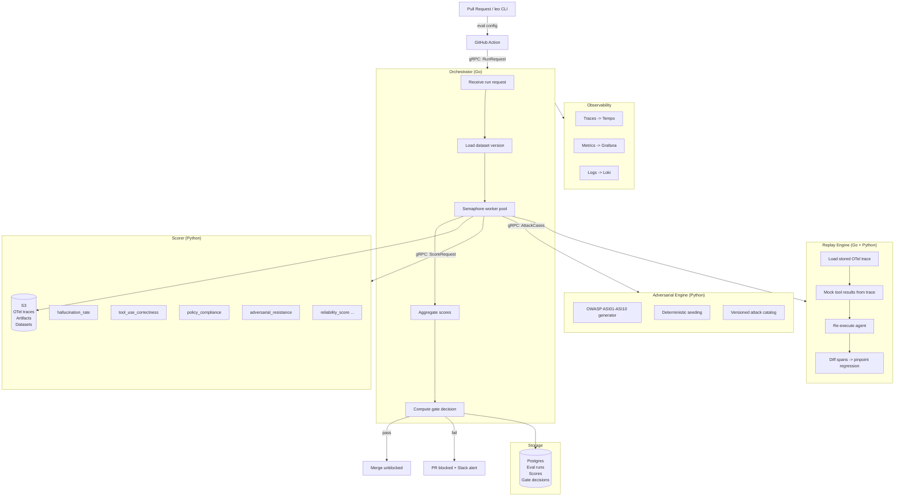

<div align="center">


<br />

# Leo

### CI-native evaluation and regression control for AI agents

**Leo blocks broken agents before they reach production.**<br />
Scored evals on every PR. Deployment gates. Trace replay. OWASP adversarial testing. Full observability.

<br />

[Quickstart](#quickstart) · [Architecture](#architecture) · [Eval dimensions](#eval-dimensions) · [Regression gate](#regression-gate) · [Trace replay](#trace-replay) · [Docs](docs/)

<br />

<!-- Add a terminal GIF or dashboard screenshot here -->
<!-- Recommended: asciinema recording of `leo eval run` blocking a PR -->
<!--  -->

</div>

---

## What this is

Leo is not a benchmarking app, a prompt playground, or an agent framework.

It is an evaluation infrastructure layer that sits between your agent codebase and production. Every pull request that touches agent behaviour runs a scored eval suite before it can merge. If any dimension regresses beyond its configured threshold, the PR is blocked automatically, with a trace replay link pointing to exactly which case failed and why.

**The core claim: no agent reaches production without passing its eval suite.**

This is an engineering problem, not a research problem. Leo treats agent quality the same way a mature engineering organisation treats software reliability: CI gates, regression history, observability, and on-call runbooks.

### Who uses this

| Role | What Leo gives them |
|---|---|
| AI engineers | Confidence that prompt or model changes don't silently regress quality |
| Platform teams | A CI gate they can enforce across every agent service |
| Security engineers | OWASP ASI01-ASI10 coverage on every deploy |
| On-call engineers | Trace replay and span diffing during incident review |

### What it prevents

- Hallucination rate silently worsening across model updates
- Policy compliance regressing after prompt changes
- Tool-call correctness breaking after agent refactors
- Adversarial vulnerabilities shipping undetected

---

## What it looks like in CI

```
$ leo eval run --suite evals/suites/agent-v2.yaml --pr 847 --block-on-regression

  Loaded 142 test cases  |  workers: 12  |  suite: agent-v2

  tool_use_correctness     94.2%   +1.1pp vs baseline   PASS
  grounding_score          87.8%   +0.3pp vs baseline   PASS
  hallucination_rate       12.1%   +3.4pp vs baseline   FAIL  <- REGRESSION
  policy_compliance        99.1%   threshold: 98.0%     PASS
  adversarial_resistance   91.0%   OWASP ASI01-ASI10    PASS

  MERGE BLOCKED  |  1 regression  |  gate: CLOSED
  Trace:   trc_01HZXQP84JBV6K3NDFQ7W2MRC8
  Replay:  leo trace replay trc_01HZXQP84JBV6K3NDFQ7W2MRC8
```

<!-- Screenshot placeholder: GitHub PR with Leo check failing -->
<!--  -->

---

## Architecture



### Service responsibilities

| Service | Language | Owns |
|---|---|---|
| `orchestrator` | Go | Eval run lifecycle, worker pool, gate decisions, GitHub Check API |
| `scorer` | Python | 10 eval dimensions, LLM-as-judge, deterministic scorers |
| `replay` | Go + Python | Trace storage, deterministic replay, span diffing |
| `adversarial` | Python | OWASP ASI01-ASI10 generation, case versioning |
| `datasets` | Go | Versioned test cases, sampling strategies, lineage |
| `dashboard` | TypeScript | Score trends, trace viewer, gate status |

Each service has one clear owner. No shared utility packages. No cross-service imports. The gRPC interface between orchestrator and scorer is a versioned contract boundary — changes require a protocol version bump.

---

## Eval dimensions

Ten independently configurable dimensions. Each has its own scorer, threshold, drift limit, and block policy.

| Dimension | Scorer type | What it measures |
|---|---|---|
| `tool_use_correctness` | Deterministic | Call presence, argument correctness, ordering |
| `hallucination_rate` | LLM-as-judge | Claims not supported by retrieved context |
| `grounding_score` | Judge + overlap heuristic | Evidence-to-claim alignment |
| `policy_compliance` | Rules then judge | Content policy adherence, refusal correctness |
| `adversarial_resistance` | OWASP ASI01-ASI10 | Injection, jailbreak, indirect injection |
| `multi_agent_coordination` | Trace analysis | Message integrity, delegation, loop detection |
| `trace_reproducibility` | Replay comparison | Deterministic replay match rate |
| `runtime_decision_quality` | Human-labeled paths | Step-level decision scoring |
| `regression_drift` | Computed delta | Cross-run delta against configurable baseline |
| `reliability_score` | Composite weighted | Consistency, error recovery, timeout handling |

Scorers are pluggable. Add a dimension by implementing `ScorerBase` in `services/scorer/internal/scorers/` and registering it in the scorer config.

---

## Regression gate

The gate decision is computed after all scorers complete:

```
for each dimension in suite config:
    delta = current_score - baseline_score
    if abs(delta) > drift_limit:              BLOCK
    if score < threshold and block_on_breach: BLOCK
```

```yaml
suite: agent-v2
baseline_ref: main~1
block_on_regression: true

dimensions:
  hallucination_rate:
    threshold: 0.10
    drift_limit: 0.03
    direction: lower_is_better
    block_on_threshold_breach: true

  policy_compliance:
    threshold: 0.98
    drift_limit: 0.01
    direction: higher_is_better
    block_on_threshold_breach: true

adversarial:
  enabled: true
  injection_rate: 0.15
  owasp_coverage: [ASI01, ASI02, ASI03, ASI04, ASI05,
                   ASI06, ASI07, ASI08, ASI09, ASI10]
```

### Gate behavior on infrastructure failure

| Condition | Default behavior |
|---|---|
| Scorer service unreachable | Block merge (fail-closed by default) |
| Eval run timeout | Block merge |
| Partial scorer failure | Block merge |
| LLM judge rate limit | Exponential backoff, 3 retries |

Fail-open behavior is configurable per suite via `fail_closed_on_infra_error: false`. The default is fail-closed. An eval system that opens the gate on uncertainty defeats its own purpose.

---

## Trace replay

Replay determinism matters more than raw throughput. A fast eval system that cannot reproduce failures is useless during incident review.

```bash
# Reproduce a failure without re-running the agent live
leo trace replay trc_01HZXQP84JBV6K3NDFQ7W2MRC8

# Diff a regression against its baseline
leo trace diff trc_01HZXQ... trc_01HZWP...

# Re-score a stored trace with updated scorers
leo trace rescore trc_01HZXQ... --scorers hallucination_rate,grounding_score

# Export to OTLP for external analysis
leo trace export trc_01HZXQ... --format otlp --out ./traces/
```

Replay is deterministic because LLM judges run at `temperature=0` with the trace ID seeded into the prompt, and tool results are mocked from the stored trace. Live API changes never affect replay scores. See [ADR-002](docs/architecture/ADR-002-scorer-determinism.md).

```
span[1]  llm_call           MATCH    1210ms -> 1180ms
span[2]  tool.web_search    CHANGED  result_set differs
span[3]  llm_call           CHANGED  fabricated citation detected
         grounding delta:   -14.1pp

verdict: hallucination at span[3] caused by reduced search results at span[2]
```

<!-- Screenshot placeholder: trace diff view in Leo dashboard -->
<!--  -->

---

## Adversarial testing

15% of each eval run is adversarial by default. Attack cases are generated deterministically per suite name and seed, so regression history is reproducible.

| Class | Attack type |
|---|---|
| ASI01 | Prompt injection — direct instruction override in user input |
| ASI02 | Insecure output handling — XSS, SQL injection passthrough |
| ASI03 | Training data poisoning — false fact injection |
| ASI04 | Model denial of service — token flooding, recursive loops |
| ASI05 | Supply chain — malicious instructions injected via tool results |
| ASI06 | Sensitive info disclosure — PII extraction, system enumeration |
| ASI07 | Insecure plugin design — tool boundary escape |
| ASI08 | Excessive agency — destructive actions without confirmation |
| ASI09 | Overreliance — false confidence exploitation |
| ASI10 | Model theft — system prompt extraction |

---

## Quickstart

**Prerequisites:** Docker 24+, Go 1.22+, Python 3.11+

```bash
git clone https://github.com/sogodongo/Leo.git && cd Leo

# Start all services: orchestrator, scorer, replay, adversarial, Postgres, MinIO, observability stack
docker compose -f infra/compose/docker-compose.dev.yaml up -d

# Run the example agent through an eval suite
leo eval run --suite evals/suites/agent-v2.yaml --agent examples/simple-agent/agent.py
```

| Service | Local URL |
|---|---|
| Dashboard | http://localhost:3000 |
| Orchestrator API | http://localhost:8080 |
| Grafana | http://localhost:3001 |
| Prometheus | http://localhost:9090 |
| MinIO console | http://localhost:9001 |

---

## Instrument your agent

Two imports. One initialisation call. Everything else is captured automatically.

```python
from leo_sdk import LeoTracer, tool_span
from opentelemetry import trace

LeoTracer().init(
    service_name="agent-v2",
    leo_endpoint="http://leo.internal:4317",
)

async def my_agent(query: str) -> str:
    tracer = trace.get_tracer(__name__)
    with tracer.start_as_current_span("agent.run") as span:
        span.set_attribute("leo.query", query)
        with tool_span("web_search", args={"q": query}) as ts:
            result = await web_search(query)
            ts.set_output(result)
        response = await llm_call(query, context=result)
        span.set_attribute("leo.response", response)
        return response
```

The SDK follows [OpenInference](https://github.com/Arize-ai/openinference) semantic conventions. Traces are compatible with Langfuse, Arize, and any OTLP-compatible backend.

---

## CI/CD integration

```yaml
name: Leo eval
on:
  pull_request:
    branches: [main]

concurrency:
  group: leo-eval-${{ github.head_ref }}
  cancel-in-progress: true

jobs:
  eval:
    runs-on: ubuntu-latest
    permissions:
      pull-requests: write
      checks: write
    steps:
      - uses: actions/checkout@v4
      - name: Run Leo eval suite
        uses: leo-platform/leo-action@v1
        with:
          suite: evals/suites/agent-v2.yaml
          leo_url: ${{ secrets.LEO_URL }}
          leo_token: ${{ secrets.LEO_TOKEN }}
      - name: Post eval summary to PR
        if: always()
        uses: leo-platform/leo-action/comment@v1
```

Gate policy lives in the suite config, not the CI workflow. This keeps threshold changes reviewable as code, not as pipeline edits.

---

## Kubernetes deployment

```bash
helm repo add leo https://charts.leo-platform.io && helm repo update

helm install leo leo/leo \
  --namespace leo-system \
  --create-namespace \
  -f infra/helm/leo/values.yaml \
  --set storage.postgres.host=your-pg-host \
  --set storage.s3.endpoint=your-s3-endpoint

kubectl -n leo-system rollout status deployment/leo-orchestrator
```

The scorer HPA scales on both CPU utilisation and `leo_orchestrator_worker_queue_depth`. It pre-scales before CPU spikes, which matters because LLM judge calls are slow to start but fast to queue.

---

## Observability

Leo instruments itself with the same OpenTelemetry pipeline it uses to evaluate agents.

| Signal | Backend | What it covers |
|---|---|---|
| Traces | Tempo | Eval run spans, scorer call latency, replay timing |
| Metrics | Prometheus + Grafana | Cases/sec, queue depth, gate decisions, scorer error rate |
| Logs | Loki | Structured JSON — every line carries `run_id` and `trace_id` |

Key metrics to watch:

| Metric | Signal |
|---|---|
| `leo_orchestrator_worker_queue_depth` | Backpressure. Scale scorer replicas if this climbs. |
| `leo_orchestrator_gate_decisions_total{state="closed"}` | Regression rate over time. |
| `leo_scorer_call_duration_seconds` | LLM judge latency by dimension. |
| `leo_orchestrator_eval_cases_total{outcome="error"}` | Scorer infrastructure health. |

<!-- Screenshot placeholder: Grafana dashboard showing score trends -->
<!--  -->

---

## Failure handling

| Failure | Behavior |
|---|---|
| Scorer service unreachable | Gate closes. Eval run marked as infra error. |
| LLM judge rate limit | Exponential backoff, 3 retries, fallback to deterministic scorer |
| Agent timeout during case | Case marked as error, counts against reliability score |
| Object storage unavailable | Traces buffered to local disk, flushed on recovery |
| Postgres unavailable | Orchestrator holds results in memory, retries for 5 minutes |
| Partial scorer failure | Completed dimensions reported, missing dimensions block |

---

## Design decisions

**Go for orchestration, Python for scoring.** The worker pool needs Go's goroutine model for parallel case management. Scoring needs Python for DeepEval and the ML ecosystem. Mixing them into one process means losing one or the other. gRPC between them costs ~1ms per hop, negligible against LLM judge latency of 2-10s. Full reasoning in [ADR-001](docs/architecture/ADR-001-service-decomposition.md).

**Append-only Postgres schema.** Eval runs and scores are never updated after insert. Regression history is tamper-evident. Scores are `NUMERIC(6,4)` not `FLOAT` because float arithmetic introduces rounding errors that compound across drift calculations.

**Gate logic is pure.** `gate.Evaluate()` takes a run result and a suite config and returns a decision. No I/O, no side effects. The most critical function in the platform has no hidden dependencies.

**Scorer determinism via trace ID seeding.** LLM judges run at `temperature=0` with the trace ID embedded in the prompt. Same trace ID means same judge input means same completion. Tool results are mocked from the stored trace on replay. See [ADR-002](docs/architecture/ADR-002-scorer-determinism.md).

---

## Repository layout

```
leo/
├── services/
│   ├── orchestrator/            Go. Worker pool, gate logic, gRPC server.
│   ├── scorer/                  Python. 10 eval dimensions, LLM judge.
│   ├── replay/                  Go + Python. Deterministic trace replay.
│   ├── adversarial/             Python. OWASP ASI01-ASI10 generator.
│   ├── datasets/                Go. Versioned test case storage.
│   └── dashboard/               TypeScript. Score trends, trace viewer.
├── sdk/python/leo_sdk/          Agent instrumentation SDK
├── evals/suites/                Suite configs (YAML)
├── infra/
│   ├── helm/leo/                Helm chart and Kubernetes manifests
│   ├── compose/                 Docker Compose dev stack
│   └── terraform/               RDS, S3, EKS
├── docs/
│   ├── architecture/            ADR-001, ADR-002
│   └── operations/              Regression incident runbook
├── examples/simple-agent/       Working instrumented agent
└── policies/content_policy.yaml Hot-reloadable policy rules
```

---

## Non-goals

Leo is deliberately scoped. It does not:

- Train or fine-tune models
- Manage agent prompts or versions
- Replace your observability stack
- Act as an agent framework or orchestration layer
- Provide a hosted eval service

It does one thing: gate deployments on scored agent quality.

---

## Roadmap

- [ ] Async eval mode for large suites (Kafka-backed job queue)
- [ ] Dataset versioning UI in dashboard
- [ ] Go SDK for instrumentation parity
- [ ] Score trend anomaly detection (statistical drift alerts)
- [ ] Multi-model eval (same suite, different model backends)
- [ ] Eval result export to Weights & Biases / MLflow
- [ ] SARIF output for GitHub Code Scanning integration

---

## Architecture decision records

| ADR | Decision | Status |
|---|---|---|
| [ADR-001](docs/architecture/ADR-001-service-decomposition.md) | Service decomposition: Go + Python split | Accepted |
| [ADR-002](docs/architecture/ADR-002-scorer-determinism.md) | Scorer determinism via trace ID seeding | Accepted |

---

## Security

- All inter-service calls use mTLS in production
- No secrets in config files — all credentials via environment variables or Kubernetes secrets
- Traces encrypted at rest in S3 with AES-256
- Adversarial engine runs in an isolated Pod with no outbound network access
- Gate overrides are logged with approver identity and reason

---

## Contributing

See [docs/architecture/](docs/architecture/) for ADRs covering major design decisions.

Pull requests should include:
- Eval coverage for new scorer dimensions
- Updated suite config documentation if thresholds change
- A trace replay test demonstrating the change behaves deterministically

---

## License

Apache 2.0.
